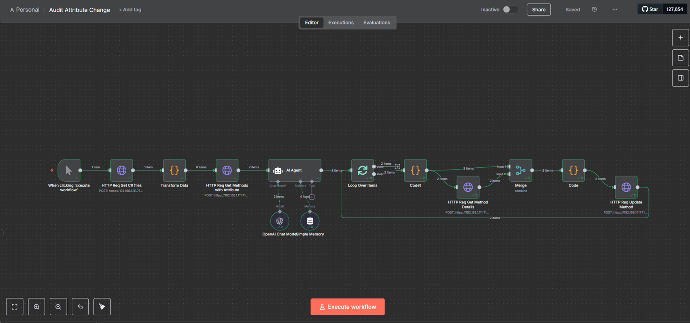

# RoslynAsAServiceAPI

A small RESTful web API that exposes selected Roslyn (Microsoft C# compiler platform) functionality and simple file operations as an HTTP service. It supports:
- HTTP server mode (with OpenAPI/Swagger for exploration)
- Command-line (CLI/headless) mode for running individual operations and piping results to scripts

Primary use case: enable n8n workflows to access and manipulate local Visual Studio project files for automated code analysis, refactoring, and modification.

## What’s new (recent additions)
- CLI/Headless mode: call handlers directly from the command line (e.g., `query-syntax-nodes`, `find-csharp-files`, `replace-range`, and file-system commands) without starting the web server.
- New file system endpoints: `/api/files/find`, `/api/files/replace-text`, `/api/files/insert-text`, `/api/files/create-file`.
- Improved JSON DTOs: explicit request/response shapes for queries and file commands (see DTO reference below).

## Features
- Code analysis: query syntax nodes, methods, and attributes in C# files
- File discovery: find C# files in specified directories
- Code modification: replace text ranges or insert/replace file text
- Local file access: direct access to local Visual Studio project files
- Security: API key authentication for all endpoints
- OpenAPI/Swagger: interactive API exploration
- n8n integration: endpoints designed for workflow automation

## Technologies
- .NET 9.0
- ASP.NET Core minimal APIs
- Microsoft.CodeAnalysis.CSharp (Roslyn)
- Microsoft.CodeAnalysis.Workspaces.MSBuild
- OpenAPI/Swagger

## Getting started

### Prerequisites
- .NET 9.0 SDK or later
- Visual Studio 2022 or VS Code (optional)

### Install and build
1) Clone and open the project folder:

```powershell
git clone <repository-url>
cd RoslynAsAServiceAPI/src/RoslynAsAServiceAPI
```

2) Restore and build:
```powershell
dotnet restore
dotnet build
```

### Run as a server
Start the HTTP server (development mode shows OpenAPI UI):

```powershell
dotnet run
```

- OpenAPI UI (development): /openapi
- Default dev URLs are printed on startup (e.g., http://localhost:5000 and https://localhost:5001)

### Run a single command (CLI mode)
Invoke handlers directly from the command line. Pass a command name and a single JSON payload argument.

Examples (PowerShell-friendly quoting):
```powershell
# Query syntax nodes in a file
dotnet run -- query-syntax-nodes '{"filePath":"C:\\path\\to\\MyFile.cs","withAttribute":null,"methodName":null}'

# Find all C# files under a folder
dotnet run -- find-csharp-files '{"path":"C:\\path\\to\\project"}'

# Replace a range of lines in a file
dotnet run -- replace-range '{"filePath":"C:\\path\\to\\MyFile.cs","startLine":10,"endLine":15,"newText":"// new\n// lines"}'
```
CLI mode writes JSON or text to stdout and uses exit codes to indicate success (0) or failure (non‑zero).

## API reference (summary)
Authentication: include header `X-API-Key: <your-key>` on every request.

Group: /api/query
- POST /api/query/syntax-nodes
  - Body: SyntaxNodeQuery { filePath, withAttribute?, methodName? }
  - Returns: FoundNode[] (file, node type, name, fullText, location, attributes)

- POST /api/query/find-csharp-files
  - Body: FindCSharpFilesQuery { path }
  - Returns: FindCSharpFilesResponse { files: string[] }

Group: /api/actions
- POST /api/actions/replace-range
  - Body: ReplaceRangeCommand { filePath, startLine, endLine, newText }

Group: /api/files
- POST /api/files/find
  - Body: FindFilesQuery { path, extension }
- POST /api/files/replace-text
  - Body: ReplaceTextCommand { filePath, oldText, newText }
- POST /api/files/insert-text
  - Body: InsertTextCommand { filePath, lineNumber, textToInsert }
- POST /api/files/create-file
  - Body: CreateFileCommand { filePath, content }

## DTO / model reference
- SyntaxNodeQuery(string FilePath, string? WithAttribute, string? MethodName)
- ReplaceRangeCommand(string FilePath, int StartLine, int EndLine, string NewText)
- FoundNode(string FilePath, string NodeType, string Name, string FullText, NodeLocation Location, List<string> Attributes)
- NodeLocation(int StartLine, int EndLine)
- FindCSharpFilesQuery(string Path)
- FindCSharpFilesResponse(List<string> Files)
- FindFilesQuery(string Path, string Extension)
- ReplaceTextCommand(string FilePath, string OldText, string NewText)
- InsertTextCommand(string FilePath, int LineNumber, string TextToInsert)
- CreateFileCommand(string FilePath, string Content)

## Configuration & security
- Configure API key in `appsettings.json` or via environment variable `ApiKey`.
- Production: enable HTTPS and secure file system access. Validate file paths to prevent directory traversal.

Example configuration:
```json
{
  "Logging": {
    "LogLevel": {
      "Default": "Information",
      "Microsoft.AspNetCore": "Warning"
    }
  },
  "ApiKey": "your-secure-api-key-here",
  "AllowedHosts": "*"
}
```

## Development

### Project structure
```
src/
├── RoslynAsAServiceAPI/
│   ├── Groups/
│   │   └── RoslynGroup.cs          # API endpoint definitions
│   ├── Models/                     # Data models (if any)
│   ├── Properties/
│   │   └── launchSettings.json     # Launch configurations
│   ├── wwwroot/
│   │   └── index.html              # Static content
│   ├── ApiKeyEndpointFilter.cs     # Authentication filter
│   ├── Program.cs                  # Application entry point
│   ├── appsettings.json            # Configuration
│   └── RoslynAsAServiceAPI.csproj  # Project file
```

### Adding new endpoints
1) Add handler methods to `Groups/RoslynGroup.cs`
2) Register the endpoint in `MapRoslynApi`
3) Define any required DTOs alongside existing ones or in a dedicated models file

### Building
```bash
# Debug build
dotnet build

# Release build
dotnet build --configuration Release
```

### Testing
- Simple HTML at root URL verifies the service is running
- Use OpenAPI/Swagger or tools like Postman for comprehensive testing

## n8n integration
This API is designed for n8n workflows to automate Visual Studio project manipulation tasks.



### Setup
1) Start the API locally
2) Configure n8n HTTP Request nodes to call endpoints

HTTP Request node basics:
- Method: POST
- URL: e.g., `http://localhost:5000/api/query/syntax-nodes`
- Authentication: None (use headers)
- Headers:
```json
{
  "Content-Type": "application/json",
  "X-API-Key": "your-api-key-here"
}
```
- Body (example for syntax-nodes):
```json
{
  "filePath": "C:\\path\\to\\your\\project\\file.cs",
  "withAttribute": null,
  "methodName": null
}
```

Common scenarios:
- Code analysis workflow: query syntax nodes in multiple files and analyze results
- Automated refactoring: find patterns and replace outdated code
- Code quality monitoring: scan for attributes/patterns and notify on issues

Example workflow steps:
1) HTTP Request: `/api/query/find-csharp-files`
2) Function: process file list
3) HTTP Request (per file): `/api/query/syntax-nodes`
4) Function: analyze syntax data
5) Email/Slack: send results/notifications

Best practices:
- Handle errors using n8n error handling
- Batch processing to avoid overwhelming the API
- Cache results to reduce repeated calls
- Store API key in n8n credentials
- For simple automations, consider CLI mode (no server startup required)

## License
MIT License. See `LICENSE`.

## Contributing
- Fork and open a PR. For major changes, open an issue first.

Development setup:
1) Clone the repository
2) Open in Visual Studio 2022 or VS Code
3) `dotnet restore`
4) Set API key in `appsettings.Development.json`
5) `dotnet run`

## Support
- Open a GitHub issue for bugs or feature requests
- Check existing issues before creating a new one
- For n8n integration questions, see the n8n section above

## Acknowledgments
- Built with Roslyn (https://github.com/dotnet/roslyn)
- Designed for n8n (https://n8n.io/)
- Uses ASP.NET Core minimal APIs
